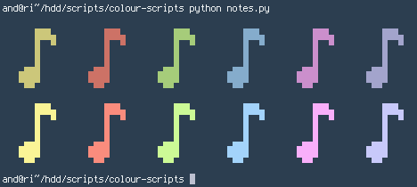
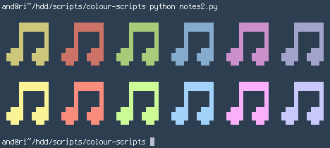
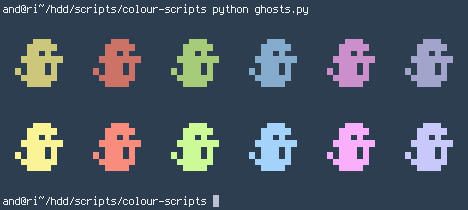
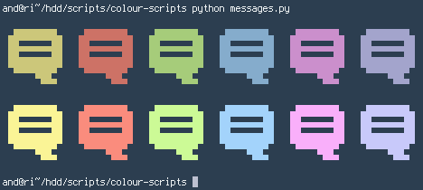
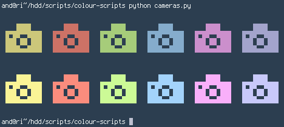
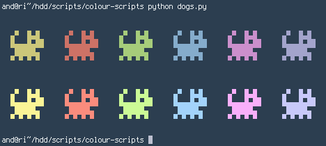
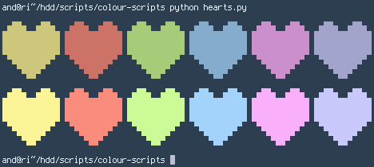
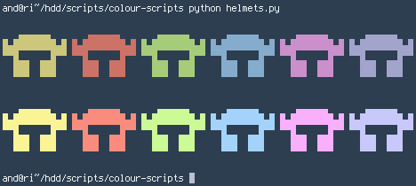
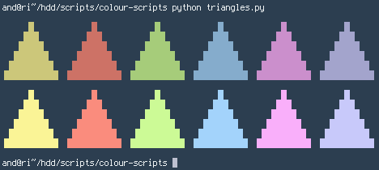

colour-scripts
=

Colour scripts made in Python for use in desktop threads and whatnot.

You can easily make your own shape and colour combination by editing one of the scripts.

The shapes are 12x12 and have one colour.

The scripts might not look good with every font. In the previews I am using Terminus.

Notes
-

Notes 2
-

Ghosts
-

Messages
-

Cameras
-

Dogs
-

Hearts
-

Helmets
-

Triangles
-

